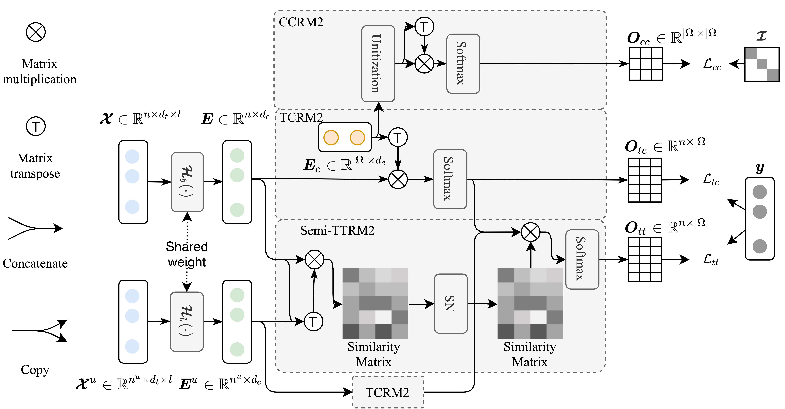

# Codes for MRM2: Multi-Relationship Modeling Module for Time Series Classification

## Overall of MRM2


## Use　

### Data
- Down Time series Datasets [UCR](https://www.cs.ucr.edu/~eamonn/time_series_data_2018/UCRArchive_2018.zip) and [UEA](http://www.timeseriesclassification.com/Downloads/Archives/Multivariate2018_ts.zip) .
- unzip the compression package to the `data` directory.
- run `python deal_multi_ts.py` to prepare the multi time series data set.


### Environment

prepare the running environment, and install the requirements. 
```
pip install -r requirements.txt
```

### runing
- univariate time series classification
  - obtain the model parameters for the first 500 epochs.
  ```
  python  TrainOrigin_uts.py \
    --data_dir './data/UCRArchive_2018/'\
    --model_name 'resnet'\
    --out_dir 'result_origin/resnet' \
    --start_dataset_id 0\
    --pretrain_model_dir ''\
    --weight_decay 0.01\
    --start_cuda_id 0\
    --gpu_nums 1\
    --max_epoch 500\
    --lr 0.001
    ``` 
    - train the origin model
    ```
    python TrainOrigin_uts_last100.py \
    --data_dir './data/UCRArchive_2018/'\
    --model_name 'fcn'\
    --out_dir 'result_fixedR_803/fcn0_0' \
    --start_dataset_id 0\
    --pretrain_model_dir './result_origin/fcn/'\
    --weight_decay 0.01\
    --start_cuda_id 0\
    --gpu_nums 1\
    --max_epoch 100\
    --lambda_loss 0.\
    --gamma_loss 0.\
    --lr 0.0001 
    ``` 
    - parameter description：
        - `data_dir` the directory for saving the data set 
        - `model_name` choice from `fcn`,`resnet`,`inceptiontime`,`os_cnn`, `fcn_lstm`
        - `out_dir` the directory for saving the results
        - `start_dataset_id` default 0
        - `pretrain_model_dir` the directory that have pretrained model
        - `weight_decay` the weight decay for model training
        - `start_cuda_id` default 0 
        - `gpu_nums` default 1
        - `max_epoch` max epoch 
        - `lambda_loss` : lambda loss equal zero in Origin model 
        - `gamma_loss` gamma loss equal zero in Origin model
        - `lr` learning rate
        
    - train the model with MRM2
    ```
    python  TrainMRM2_uts.py \
    --data_dir './data/UCRArchive_2018/'\
    --model_name 'fcn'\
    --out_dir 'result_fixedR_803/fcn' \
    --start_dataset_id 0\
    --pretrain_model_dir './result_origin/fcn/'\
    --weight_decay 0.01\
    --start_cuda_id 0\
    --gpu_nums 1\
    --max_epoch 100\
    --lr 0.0001 
    ```
- Multivariate time series classification
    - obtrainthe model parameters in the first 500 epoch.
    ```
    python TrainOrigin_mts.py \
    --data_dir './data/Multivariate_ts_np'\
    --model_name 'fcn_lstm'\
    --out_dir 'result_origin_multi/fcn_lstm' \
    --start_dataset_id 0\
    --pretrain_model_dir ''\
    --weight_decay 0.01\
    --start_cuda_id 0\
    --gpu_nums 1\
    --max_epoch 500\
    --lr 0.001 
    ```
    -  train the origin model
    ```
    python TrainOrigin_mts_last100.py \
    --data_dir './data/Multivariate_ts_np'\
    --model_name 'fcn_lstm'\
    --out_dir 'result_fixedR_803/fcn_lstm_multi0_0' \
    --start_dataset_id 0\
    --pretrain_model_dir './result_origin_multi/fcn_lstm/'\
    --weight_decay 0.01\
    --start_cuda_id 0\
    --gpu_nums 1\
    --max_epoch 100\
    --lambda_loss 0.\
    --gamma_loss 0.\
    --lr 0.0001
    ```
    -  train the model with MRM2
    ```
    python TrainMRM2_mts.py \
    --data_dir './data/Multivariate_ts_np'\
    --model_name 'fcn_lstm'\
    --out_dir 'result_fixedR_803/fcn_lstm_multi' \
    --start_dataset_id 0\
    --pretrain_model_dir './result_origin_multi/fcn_lstm/'\
    --weight_decay 0.01\
    --start_cuda_id 0\
    --gpu_nums 1\
    --max_epoch 100\
    --lr 0.0001
    ```

